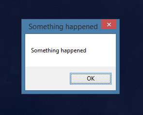

# Setup

* Clone this repository: `git clone https://github.com/garrettgsb/errors-and-promises.git`
* `yarn` or `npm install`
* Create a file called `.env` in the project directory with the following (fake) keys:

```
OXFORD_ID=abcdefg
OXFORD_KEY=0a1b2c3d4e5f6g
```

* Sign up with Oxford Dictionaries to be given your own API credentials: https://developer.oxforddictionaries.com/
* Replace the fake credentials in your `.env` file with those credentials

* Start the server: `node server.js`
* Point your favorite browser to `localhost:8080`

# TL;DR:

**Errors**

* Good errors are descriptive
* Handle errors with try-catch, instead of letting them explode your app
* When should errors occur?
  - As soon as it's possible to know that something is wrong
* Fail loud, fail early
* If `throw new Error()` is too invasive, try `console.error` or `console.warn`

**Asynchrony**

* Nonblocking/Asynchronous:
  - Says "Don't wait for me" to other procedures
  - Event handlers are asynchronous: `onclick`, `onsubmit`
  - API/database calls _should_ be asynchronous from the perspective of most of the app
* Blocking/Synchronous:
  - Says "Wait for me" to other procedures
  - Code that makes other code wait
  - API/database calls should be synchronous from the perspective of the code that depends on the result
* Javascript is an inherently asynchronous language
* Promises, callbacks, etc. encapsulate the parts of a system that _must_ be synchronous (so that the rest can be asynchronous)

**Promise Mechanics**

  * Most promises that you'll use are promises provided by library/framework code, especially:
    - API calls
    - Database queries

  * Promises don't `return 'foo'`; Instead, they either `resolve('foo')` or `reject('foo')`
  * If it resolves: `.then()` receives the output and runs its callback
  * If it rejects: `.catch()` receives the output and runs its callback
  * `.then()` always returns a Promise
    - Which means that you're never _really_ getting out of Promise Land
      * And you shouldn't want to 💁‍♂️

**Designing With Promises**

* Asynchrony with Promises is not too different from asynchrony with callbacks
* Promises organize code into **dependency sequences**
* BAD: "Go into a Promise chain, bring the value out at the end"
* GOOD: "Go into a Promise chain, execute the desired behavior at the end"

**Advanced Promising**
  * `Promise.all` - Receives an array of Promises; Doesn't run `.then()` until they've all resolved or rejected
    - Useful for multiple dependencies, like waiting for 5 separate API calls to return
  * `Promise.race` - Runs `.then()` as soon as _one_ of the Promises resolve
    - Useful for multiple sources that satisfy the same dependency
    - e.g. Asking 3 different weather APIs what temperature it is outside

# Errors

Errors are good-- They tell you when (and, hopefully, how) your code is bad. Good errors give you the context that you need to fix it in a hurry. A good error tells you:

* What type of thing went wrong
* Which values were involved
* Where in the code the problem occurred

A bad error fails to give context about what is actually wrong.



Throwing an error is kind of like throwing a ball, but it's also kind of like throwing a tantrum: The error travels up the call stack, looking for something that can handle it, like a retail customer who keeps asking to speak with everybody's manager.

If the error makes its way all the way up to the root process-- the Node/browser runtime-- then the app crashes.

Errors are useful and descriptive, but having our app self-destruct every time somebody spills a glass of water seems like a steep trade-off. But we don't have to live with a gun to our heads like that-- that's where **error handling** comes in.

## Handling Errors with Try-Catch

The "try-catch" pattern (and, in Javascript, language feature) is the bread and butter tool for error handling. It looks like this:

```
try {
  null.forEach(widget => widget.length); // <- Super doesn't work
} catch (error) {
  console.error(error);
}
```

What this code says is "Try to do the thing in the first block. If that fails for some reason, instead of just terminating the application, do what it says in the second `catch` block (and pass the error along in a variable called `error`)."

With "try-catch", we can write code that tells the application how to behave when there is an error. In other words, instead of errors just being a snag for our app to faceplant on, we can take control of how they are handled.

## Custom Errors

**Fail loud, fail early**

Sometimes, you want errors to occur even though nothing has gone wrong as far as the Javascript interpreter is concerned. For that, we can use the `throw` keyword:

```
function eatAvocado(condiments) {
  if (condiments.includes('ketchup')) {
    throw "Ew don't."
  }
}
```

A line that begins with the `throw` keyword will have the same behavior as an error thrown by the interpreter: The error will bubble up until it either hits a `try`-`catch` block, or crash the app if it reaches the top of the call stack.

Speaking of the call stack though, where is that? Don't errors usually tell us more about where the error occurred?

Yes they do-- But in the example above, we didn't throw an _error_, we just threw a _string_. To see the full call stack (and get [some other fun features](https://developer.mozilla.org/en-US/docs/Web/JavaScript/Reference/Global_Objects/Error)), we want to throw a new instance of an Error object:

```
function singDuet(singers) {
  if (!singers.length === 2) {
    throw new Error("You need exactly 2 singers for a duet!");
  }
  singers.forEach(singer => singer.sing());
}
```

**Documentation in Errors**

> _Any fool can write code that a computer can understand. Good programmers write code that humans can understand._
    - Kent Beck

An important measure of code quality is how easy it is to understand the code's _intent_. One way to do that is by leaving comments:

```
function divide(a, b) {
  // a and b must be numbers
  // b can't be 0
  return a / b;
}
```

Those are helpful, and it's a good instinct to document those changes, but the problem is that the **comments are are divorced from the functionality of the code**. When possible, we should move the information contained in the comments into the code itself. One way to do this is with custom errors. Here is the same function, modified to be **self-documenting**:

```
function divide(a, b) {
  if (typeof a !== 'number' || typeof b !== 'number') {
    throw new Error(`Parameters to function 'divide' must be numbers. Received a: ${a} and b: ${b}.`);
  }
  if (b === 0) {
    throw new Error("Function 'divide' cannot receive 0 as a second parameter.");
  }
  // b can't be 0
  return a / b;
}
```

If you find that it's a little too aggressive to crash the whole app when something like this goes wrong, try `console.error` or `console.warn`. They will give the loud appearance of an error in the console, but won't actually trigger the "catch or die" behavior of a thrown error.

### Custom Error Classes

If we want very robust errors, we can create custom classes that inherit from the Error object:

```
class TooManySingersError extends Error {
  constructor(singers, ...params) {
    super(...params);
    this.name = "TooManySingersError";
    this.message = `Duets must have exactly 2 singers. Given ${singers.length}`
  }
}
```

To be clear: This is not a very common thing to do in application code, so we won't spend too long on it.

## Errors Summary

* `try`-`catch` to recover from errors
* `throw new Error('message')` to create errors
* Fail loud, fail early
* Constraints are good
* Document behavior and intent-- Comments are good, code is better.

# Procedural Programming and its Shortcomings

When you are first learning to code, you are generally learning some form of procedural programming. This paradigm is simply the idea that **a program consists of a series of computational steps to be carried out in order.** Procedural code might look something like this:

```
const totalBill = 83.50;
const taxRate = 0.14;
const diners = [
  "Alice",
  "Bob",
  "Carol",
  "Dean",
];
const randomIndex = Math.floor(Math.random() * diners.length);
console.log(`${diners[randomIndex]} will get the bill, which comes to ${totalBill * (1 + taxRate)}, plus the tip.`);
```

It almost goes without saying that when the script is run, it flows line-by-line in source order until it finishes, and then exits gracefully. But some code, by nature, can't be written in this way:

A web server, for example, can't respond to an HTTP request at initial runtime-- It can only respond when a request is made.

Similarly, a user interface can't (or, at least, shouldn't) submit a form when the app first loads-- It should only do so in response to input from the user.

When we are solving problems like building web servers or user interfaces, we are no longer thinking in terms of executing a procedure line-by-line; Rather, we should think of the code we write for these purposes as **definitions of behaviors to be performed later.**

# Asynchrony in Javascript

Javascript is, first and foremost, a language for adding interactivity to webpages. To program an interactive webpage is to establish behaviors that occur in response to a trigger. Triggers can be all sorts of things:

* The page loads (`$(document).ready(...)`)
* The user clicks somewhere
* A timer expires
* An HTTP response is received
* The value of an input field changes

And many more. In front end web development, defining responses to these behaviors is the whole game.

As a result, Javascript was designed so that it would be easy for many of these behavior chains to be running at the same time: Javascript can listen for a click _while_ validating an email address _while_ making a dozen AJAX requests _while_ counting to 20, _while_ animating a menu unrolling across the screen, for example.

For that to be possible, each of these activities needs to be **non-blocking:** That is, the rest of the app doesn't need to stop and wait for one thing to finish to carry on with the others.

Most languages support this style of programming in some capacity. Not all of them are good at it.

## Dependent Behavior

Mastering asynchrony is a matter of mastering **dependencies**. You might say that making a sandwich is **dependent** on having bread. To say the same thing in reverse: Bread is a dependency of a sandwich.

Some real-world dependencies are obvious: Getting on a bus is dependent on the bus arriving, for example. "First, wait for the bus to arrive. Then, get on the bus."

This is the same sort of pattern that we use when writing asynchronous code: "First, wait for the HTTP response. Then, use the data from the response to build an HTML object." To render the data before it's received is nonsense-- The "build" step is dependent on the "receive" step, so the code must enforce the correct order of operations. That's what Promises are for!

# Promises

**Promises are a tool for enforcing dependencies in asynchronous systems**

Although it's simple to create your own Promises, almost all of your time using them will be spent with _tools that return Promises_, like Knex, or the `fetch` API built into the browser. In Javascript, you can expect that **any time your application interacts with something outside** of the Node/browser process, a Promise is a likely interface for brokering that interaction. In web development, this is most usually either an **HTTP request** or a **database query**.

There are three ways to think of Promises. From most to least abstract:

* As a pattern
* As a language feature
* As the thing you use to make API/database calls

## Philosophy: Promises as a pattern

Promises are an agreement to hand off control to another process, and a plan for what to do when you get it back again.

Promises allow you to serialize dependent behaviors, instead of nesting them (as is done with conventional callbacks). This allows a cleaner interface between procedures: Each step does its job, then passes on a result.

## Mechanics: Promises as a Language Feature

### From the outside

At its simplest, programming a synchronous dependency chain with a Promise looks like this:

**Step 1:** Invoke a function that returns a Promise
**Step 2:** Call `.then()` on the return value
**Step 3:** Pass `.then()` a callback function that receives one parameter: A result
**Step 4:** Do stuff with the result _inside_ of the callback

```
getUsers().then(result => console.log("All of the users:", result));
```

Of course, the callback doesn't need to be an inline anonymous function:

```
function logUsers(users) {
  console.log("All of the users:", result);
}

getUsers().then(logUsers);
```

Any value that is returned from a `.then()` is, itself, a Promise, even if its value isn't some spooky asynchronous thing. As a result, we can chain `.then()` calls as many times as we want:

```
getUsers()
  .then(users => user.map(user => user.id))
  .then(userIds => adminFilter(userIds))
  .then(admins => console.log('Admins:', admins));
```

Note that we don't need to know how `getUsers` works, other than that it returns a Promise. **All Promises have the same interface:** Pass my result along to the next `.then()`.

**Dealing with Errors**

It is a good idea to add one more step to the workflow above, to handle anything that goes wrong:

**Step 5:** Add a `.catch()` with a callback function to handle any errors

If a Promise rejects instead of resolving, or if there are any errors in the chain, then the function passed to `.catch()` will run, receiving the error as a parameter.

```
doSomethingDangerous()
  .then(result => result.forEach(item => item.toUpperCase())) // Oh man, I hope this is an array of strings!
  .catch(error => console.error(error));
```

### From the inside

A Promise can have three states:

* Pending
* Resolved
* Rejected

When a Promise is first created, it is in the Pending state. The code inside of it runs, and **instead of `return`ing something**, it will either call a function called `resolve()` or a function called `reject()`. If `resolve()` is called, then the parameter that it is passed is given to the next `.then()` call in the chain. If `reject()` is called, then the parameter that it receives is passed to the first `.catch()` call. A (fairly pointless) custom Promise that implements a coin flip might look something like this:

```
new Promise((resolve, reject) => {
  if (Math.random() > 0.5) {
    resolve("Heads 🗣");
  } else {
    reject("Tails 🦆");
  }
}).then(result => console.log("Should be heads:", result)).catch(error => console.error("Should be tails:", error));
```

## Designing With Promises

Perhaps the most common sticking point with Promises is trying to use procedural code to do asynchronous stuff. We think, "I'll just dip into the Promise mode for a second to do that spooky asynchronous thing, then pop back out and carry on." But Promises don't work like this:

```
const city = "Vancouver";
const weather = getWeatherFor(city).then(result => return result);
console.log(`It's gonna be ${weather}-y out!`);
```

Or even like this (although this _could_ actually work, by accident):

```
const city = "Vancouver";
let weather;
getWeatherFor(city).then(result => weather = result);
console.log(`It's gonna be ${weather}-y out!`);
```

In the examples above, we go into Promise-land, get a value, pull it back out, and then resume our top-level procedure. But we shouldn't think of Promises as just a way to grab data-- We should think of Promises as a separate behavior chain that _does not_ (usually) return a value to the top level: **Any work that depends on the Promise result is done inside of the Promise chain**

So your Promise code should look like this instead:

```
const city = "Vancouver";
getWeatherFor(city).then(result => console.log(`It's gonna be ${result}-y out!`));
```

### What if I need data outside of the Promise?

Okay, so realistically, sometimes you're going to want the result of a Promise to be available to code that is not inside of the Promise chain. We can use normal scoping rules to make this possible:

```
let user;
getUser().then(result => user = result;).catch(error => throw error);
```

**⚠️ WARNING:** If you're going to take this approach, then your application must know how to behave if `user` is undefined, not defined, null, empty, or otherwise not there. For more on how to do this, reach out to your favorite mentor.

# Example: Using Promises with Goodwords

Goodwords follows this workflow:
  * **Client:** A button is listening for clicks
  * **Client:** When clicked, it reads the value of an input field
  * **Client:** A `fetch` request is made with that value
  * **Server:** Express receives the request to the `/words/:word` endpoint
  * **Server:** The word is pulled from the URL params
  * **Server:** An API request is made to the Oxford Dictionary API (`lookupWord()`)
  * **Oxford API:** Does something-- who knows what?-- and returns a response
  * **Server:** Sends the response from the Oxford API back to the client
  * **Client:** Parses the response for definitions, and renders them onto the page (`handleOxfordResponse()`, `renderDefinition()`)

In this workflow, where would we expect to find Promises? Where is control handed off?

## Appendix A: Advanced Promise Features

* `Promise.all` - Receives an array of Promises; Doesn't run `.then()` until they've all resolved or rejected
  - Treat _many_ Promises like _one_ Promise
  - Useful for multiple dependencies, like waiting for 5 separate API calls to return
* `Promise.race` - Runs `.then()` as soon as _one_ of the Promises resolve
  - Useful for a _single_ dependency that can be satisfied in _multiple ways_
  - e.g. Asking 3 different weather APIs what temperature it is outside


# Appendix A: Fetch crash course

Fetch is built into your browser. It allows you to make HTTP requests with Promises, and is far simpler than the other built-in browser tools. There is one very conspicuous weird thing, but if you can get over it, Fetch is outstandingly handy.

A basic fetch request works like this:

```
fetch('www.website.com')
.then(stream => stream.json())
.then(actualResult => console.log(actualResult))
```

For some reason, the folks who developed `fetch` decided that you need to process the stream yourself in the first `.then()`-- It isn't the readable result yet. Usually, you just want to turn it into JSON, as above.

Fetch isn't just for simple GET requests-- You can do all sorts of more complicated things with it, including POST requests. [MDN really wants to tell you more about that](https://developer.mozilla.org/en-US/docs/Web/API/Fetch_API/Using_Fetch).
